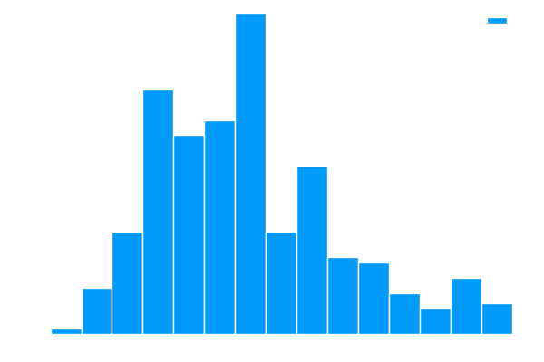

# Financial Data Weighting

## The Challenge of Non-IID Data in Finance

You might have noticed that many financial models rely on the assumption that data points are independent and identically distributed (IID). However, this is often not the case in real-world financial applications. This blog post will show you how to leverage sample weights to address these challenges.

## When and Why Does the IID Assumption Fail?

Financial labels, such as returns, are often based on overlapping time intervals. This overlapping nature makes these labels non-IID. While some machine learning applications can manage without the IID assumption, most financial models struggle without it. Let's explore some techniques to mitigate this issue.

## Defining Concurrency in Financial Labels

We say that two labels, $y_i$ and $y_j$, are concurrent if they depend on the same return. To quantify this, we use an indicator function, $ \mathbb{I}_{t, i} $, defined as:

$$
\mathbb{I}_{t, i} = 
\begin{cases} 
1 & \text{if } [t_{i, 0}, t_{i, 1}] \text{ overlaps with } [t-1, t], \\
0 & \text{otherwise.}
\end{cases}
$$

The number of labels that are concurrent at time $t$ is represented by $ c_t = \sum_{i=1}^{I} \mathbb{I}_{t, i} $.

<div style="display: flex; justify-content: center;">
  <table style="width:80%">
    <tr><th style="width:50%; text-align: center">Python</th><th style="width:50%; text-align: center">Julia</th></tr>
    <tr><td style="border: 1px solid transparent">

  ```python
  def concurrencyEvents(
        closeIndex: pd.DataFrame,
        timestamp: pd.DataFrame,
        molecule: pd.Series
  ) -> None:
  ```
  </td><td style="border: 1px solid transparent">

  ```julia
  function concurrencyEvents(
        closeIndex::DataFrame,
        timestamp::DataFrame,
        molecule::Vector
  )::DataFrame
  ```
  </td></tr>
  <tr><td colspan="2" style="text-align: center">View More: <a href="https://www.github.com/risklabai/RiskLabAI.py">Python</a> | <a href="https://www.github.com/risklabai/RiskLabAI.jl">Julia</a></td></tr>
  </table>
</div>

## Measuring Label Uniqueness

Next, we introduce a function to measure label uniqueness at a given time $ t $. This function, denoted as $ u_{t, i} $, is defined as:

$$
u_{t, i} = \frac{\mathbb{I}_{t, i}}{c_{t}}
$$

The average uniqueness of a label $ i $ over time $ T $ is given by:

$$
\bar{u}_{i} = \frac{\sum_{t=1}^{T} u_{t, i}}{\sum_{t=1}^{T} \mathbb{I}_{t, i}}
$$

<div style="text-align:center">
<figure>

<figcaption>Histogram of uniqueness values</figcaption>
</figure>
</div>

In both RiskLabAI's Python and Julia libraries, you can estimate label uniqueness using specific functions.

<div style="display: flex; justify-content: center;">
  <table style="width:80%">
    <tr><th style="width:50%; text-align: center">Python</th><th style="width:50%; text-align: center">Julia</th></tr>
    <tr><td style="border: 1px solid transparent">

  ```python
  def mpSampleWeight(
        timestamp: pd.DataFrame,
        concurrencyEvents: pd.DataFrame,
        molecule: pd.Series
  ) -> None:
  ```
  </td><td style="border: 1px solid transparent">

  ```julia
  function sampleWeight(
        timestamp::DataFrame,
        concurrencyEvents::DataFrame,
        molecule::Vector
  )::DataFrame
  ```
  </td></tr>
  <tr><td colspan="2" style="text-align: center">View More: <a href="https://www.github.com/risklabai/RiskLabAI.py">Python</a> | <a href="https://www.github.com/risklabai/RiskLabAI.jl">Julia</a></td></tr>
  </table>
</div>

## Overlapping Outcomes Problem in Bootstrapping

When using bootstrapping to sample $I$ items from a set of $I$ items with replacements, there's a chance some items get selected more than once, leading to overlapping outcomes. For larger sets, the probability of not selecting a particular element converges to $e^{-1}$. As a result, only about $2/3$ of the observations are unique, making bootstrapping inefficient.

## Solving with Sequential Bootstrapping

Sequential bootstrapping assigns different probabilities to observations, making the sampling process more efficient. The probability density for selecting observation $i$ at step $m$ is calculated using:

$$
\delta_{i}^{(m)}=\frac{\bar{u}_{i}^{(m)}}{\sum_{k=1}^{I} \bar{u}_{k}^{(m)}}
$$

where $\bar{u}_{i}^{(m)}$ and $u_{t, i}^{(m)}$ are computed using specific formulas. This approach minimizes the chance of selecting overlapping outcomes.

### Index Matrix Calculation

Both Python and Julia libraries in RiskLabAI offer functions to calculate the index matrix. In Python, it's `index_matrix` and in Julia, it's `indexMatrix`.

<div style="display: flex; justify-content: center;"><table style="width:80%"><tr><th style="width:50%; text-align: center">Python</th><th style="width:50%; text-align: center">Julia</th></tr><tr><td style="border: 1px solid transparent">

```python
def index_matrix(
  barIndex: pd.DataFrame,
  timestamp: pd.DataFrame
) -> np.array:
```
</td><td style="border: 1px solid transparent">

```julia
function indexMatrix(
  barIndex::Vector,
  timestamp::DataFrame
)::Matrix
```
</td></tr><tr><td colspan="2" style="text-align: center">View More: <a href="https://www.github.com/risklabai/RiskLabAI.py">Python</a> | <a href="https://www.github.com/risklabai/RiskLabAI.jl">Julia</a></td></tr></table></div>

### Calculating Average Uniqueness

Both libraries also offer functions to calculate the average uniqueness of the samples. In Python, it's `averageUniqueness` and in Julia, it's also `averageUniqueness`.

<div style="display: flex; justify-content: center;"><table style="width:80%"><tr><th style="width:50%; text-align: center">Python</th><th style="width:50%; text-align: center">Julia</th></tr><tr><td style="border: 1px solid transparent">

```python
def averageUniqueness(
  indexMatrix: np.array
) -> np.array:
```
</td><td style="border: 1px solid transparent">

```julia
function averageUniqueness(
  IndexMatrix::Matrix
)::Vector
```
</td></tr><tr><td colspan="2" style="text-align: center">View More: <a href="https://www.github.com/risklabai/RiskLabAI.py">Python</a> | <a href="https://www.github.com/risklabai/RiskLabAI.jl">Julia</a></td></tr></table></div>

### Sequential Bootstrap Sampling

Finally, for sequential bootstrap sampling, the Python function is `SequentialBootstrap` and in Julia, it's `sequentialBootstrap`.

<div style="display: flex; justify-content: center;"><table style="width:80%"><tr><th style="width:50%; text-align: center">Python</th><th style="width:50%; text-align: center">Julia</th></tr><tr><td style="border: 1px solid transparent">

```python
def sequential_bootstrap(
  indexMatrix: np.array,
  sampleLength: int
) -> np.array:
```
</td><td style="border: 1px solid transparent">

```julia
function sequentialBootstrap(
  indexMatrix::Matrix,
  sampleLength::Int64
)::Vector
```
</td></tr><tr><td colspan="2" style="text-align: center">View More: <a href="https://www.github.com/risklabai/RiskLabAI.py">Python</a> | <a href="https://www.github.com/risklabai/RiskLabAI.jl">Julia</a></td></tr></table></div>

These functionalities are available in both Python and Julia in the RiskLabAI library. For more details, you can visit the GitHub repositories for each language.

## Monte Carlo Verification of Method Effectiveness

Our goal is to assess the performance of different bootstrapping techniques. We focus on comparing the Sequential Bootstrap method with the Standard Bootstrap. We accomplish this through Monte Carlo experiments that utilize random timestamps and various other parameters.

### Generating Random Timestamps

We generate random timestamps for each observation within the given parameters. The function `randomTimestamp` does this job in both the Python and Julia libraries of RiskLabAI.

<div style="display: flex; justify-content: center;"><table style="width:80%"><tr><th style="width:50%; text-align: center">Python</th><th style="width:50%; text-align: center">Julia</th></tr><tr><td style="border: 1px solid transparent">

```python
def randomTimestamp(
  nObservation: int,
  nBars: int,
  maximumHolding: int
) -> None:
```
</td><td style="border: 1px solid transparent">

```julia
function randomTimestamp(
  nObservation::Int64,
  nBars::Int64,
  maximumHolding::Int64
)::DataFrame
end
```
</td></tr><tr><td colspan="2" style="text-align: center">View More: <a href="https://www.github.com/risklabai/RiskLabAI.py">Python</a> | <a href="https://www.github.com/risklabai/RiskLabAI.jl">Julia</a></td></tr></table></div>

### Monte Carlo Simulation for Sequential Bootstraps

We run Monte Carlo simulations to compare the Sequential Bootstrap with the Standard Bootstrap using the `monteCarloSimulationforSequentionalBootstraps` function.

<div style="display: flex; justify-content: center;"><table style="width:80%"><tr><th style="width:50%; text-align: center">Python</th><th style="width:50%; text-align: center">Julia</th></tr><tr><td style="border: 1px solid transparent">

```python
def MonteCarloSimulationforSequentionalBootstraps(
  nObservation: int,
  nBars: int,
  maximumHolding: int
) -> None:
```
</td><td style="border: 1px solid transparent">

```julia
function monteCarloSimulationforSequentionalBootstraps(
  nObservation::Int64,
  nBars::Int64,
  maximumHolding::Int64
)::Tuple{Float64,Float64}
end
```
</td></tr><tr><td colspan="2" style="text-align: center">View More: <a href="https://www.github.com/risklabai/RiskLabAI.py">Python</a> | <a href="https://www.github.com/risklabai/RiskLabAI.jl">Julia</a></td></tr></table></div>

### Multiple Iterations

For a more robust assessment, we run the Monte Carlo simulation in multiple iterations for both Sequential and Standard Bootstraps using `SimulateSequentionalVsStandardBootstrap`.

<div style="display: flex; justify-content: center;"><table style="width:80%"><tr><th style="width:50%; text-align: center">Python</th><th style="width:50%; text-align: center">Julia</th></tr><tr><td style="border: 1px solid transparent">

```python
def SimulateSequentionalVsStandardBootstrap(
  iteration: int,
  nObservation: int,
  nBars: int,
  maximumHolding: int
) -> None:
```
</td><td style="border: 1px solid transparent">

```julia
function SimulateSequentionalVsStandardBootstrap(
  iteration::Int64,
  nObservation::Int64,
  nBars::Int64,
  maximumHolding::Int64
)::Tuple{Vector,Vector}
end
```
</td></tr><tr><td colspan="2" style="text-align: center">View More: <a href="https://www.github.com/risklabai/RiskLabAI.py">Python</a> | <a href="https://www.github.com/risklabai/RiskLabAI.jl">Julia</a></td></tr></table></div>

### Results and Figures

The Monte Carlo tests reveal differences between Standard and Sequential Bootstraps.

<figure style="text-align:center">
<figcaption><span style="color:DimGray; font-weight:bold">Standard versus Sequential Bootstrap</span></figcaption></figure>

We also examine the histogram of the average uniqueness for both bootstrapping techniques. This gives us insights into how unique each sample is, allowing for better analysis.

## Weighting Returns in Machine Learning Models
In machine learning for finance, it's critical to weigh data properly. Returns with high absolute values should have more weight than those with low absolute returns. The uniqueness of an observation also plays a role in determining its weight. 

### Calculating Sample Weight with Return Attribution
In RiskLabAI, we offer functions to handle this weight assignment. The Julia function `sampleWeight` and the Python function `mpSampleWeightAbsoluteReturn` both serve this purpose.

<div style="display: flex; justify-content: center;">
<table style="width:80%">
<tr><th style="width:50%; text-align: center">Python</th><th style="width:50%; text-align: center">Julia</th></tr><tr><td style="border: 1px solid transparent">

  ```python
  def mpSampleWeightAbsoluteReturn(
      timestamp :pd.DataFrame,
      concurrencyEvents :pd.DataFrame,
      returns :pd.DataFrame,
      molecule :np.array
  ) -> None:
  ```
</td><td style="border: 1px solid transparent">

  ```julia
  function sampleWeight(
      timestamp :pd.DataFrame,
      concurrencyEvents :pd.DataFrame,
      returns :pd.Series,
      molecule :np.array
  )
  ```
</td></tr><tr><td colspan="2" style="text-align: center">View More: <a href="https://www.github.com/risklabai/RiskLabAI.py">Python</a> | <a href="https://www.github.com/risklabai/RiskLabAI.jl">Julia</a></td></tr></table></div>

These functionalities are available in both Python and Julia in the RiskLabAI library.

### Time-Decay of Sample Weights
Over time, older market data becomes less relevant. Thus, a time-decay factor is applied to the sample weights. The decay factor is defined by a user-specified parameter $ c $. The weight decay follows the formula:

$$
d = \max \{0, a + b x\}
$$

where $ a $ and $ b $ are calculated based on boundary conditions and $ c $.

Again, RiskLabAI has built-in functions for this. The Julia function `TimeDecay` and its Python equivalent handle weight adjustments based on time.

<div style="display: flex; justify-content: center;">
<table style="width:80%">
<tr><th style="width:50%; text-align: center">Python</th><th style="width:50%; text-align: center">Julia</th></tr><tr><td style="border: 1px solid transparent">

  ```python
  def timeDecay(
      weight :pd.Series,
      clfLastW = 1.0 :float
  ) -> None:
  ```
</td><td style="border: 1px solid transparent">

  ```julia
  function TimeDecay(
      weight;
      clfLastW = 1.0
  )::Nothing
  ```
</td></tr><tr><td colspan="2" style="text-align: center">View More: <a href="https://www.github.com/risklabai/RiskLabAI.py">Python</a> | <a href="https://www.github.com/risklabai/RiskLabAI.jl">Julia</a></td></tr></table></div>

These functionalities are available in both Python and Julia in the RiskLabAI library.

### Cases to Consider for Time-Decay
- $ c=1 $ implies no decay.
- $ 0 < c < 1 $ implies linear decay, with all observations still getting some weight.
- $ c=0 $ leads to weights converging to zero as they age.
- $ c < 0 $ implies that the oldest observations get zero weight.

<div style="display: flex; justify-content: center;">
  <figure>
  <figcaption><span style="color:DimGray; font-weight:bold">Time decay</span></figcaption></figure>
</div>

### References

1. De Prado, M. L. (2018). Advances in financial machine learning. John Wiley & Sons.
2. de Prado, M. M. L. (2020). Machine learning for asset managers. Cambridge University Press.