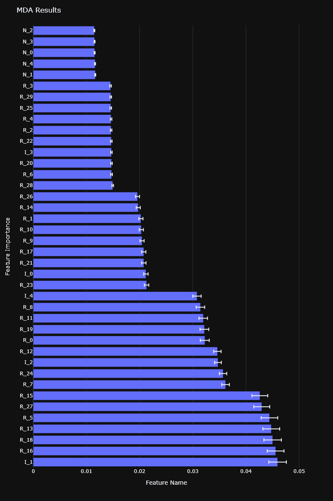
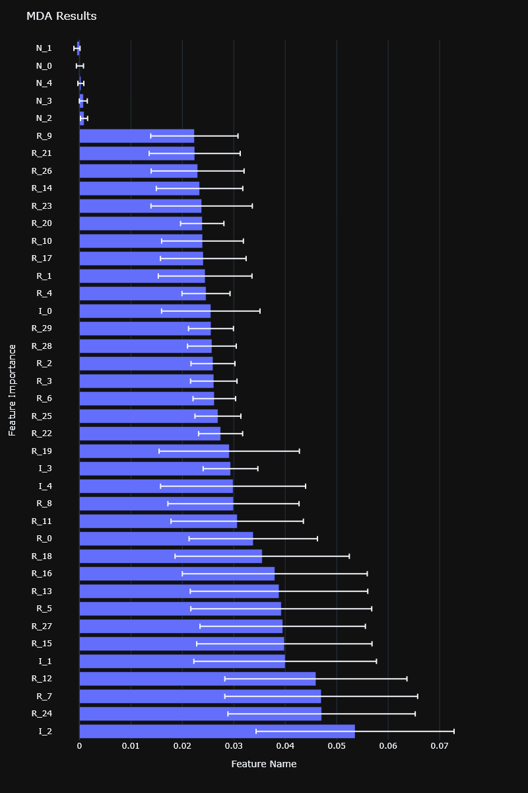
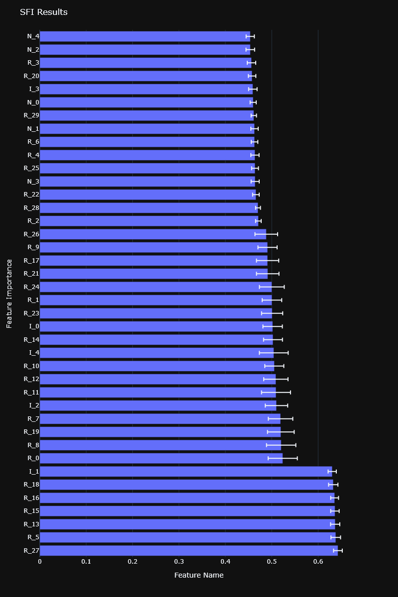

### Why Backtesting is Not Enough

Overfitting can be especially problematic when we rely solely on backtesting for validation. To improve model performance and interpretation, one must look beyond simple backtesting and consider other analyses like feature importance.

### The Importance of Features

Features are the variables or columns in our data that the machine learning algorithm uses for making predictions. Knowing which features are important can help in both understanding how the model is making predictions and in improving the model's performance. This brings us to the subject of feature importance methods.

#### Dealing with Substitution Effects

In machine learning, a "substitution effect" can dilute the importance of features that are interchangeable. This is similar to "multi-collinearity" in statistics. One way to handle this is to perform Principal Component Analysis (PCA) before feature significance analysis.

### Methods of Feature Importance

1. **Mean Decrease Impurity (MDI)**: This is mainly used in tree-based classifiers. It calculates how much each feature decreases impurity.

    - Pros: Quick to compute, well-suited for tree-based classifiers.
    - Cons: Susceptible to substitution effects, not generalizable to non-tree-based classifiers.

2. **Mean Decrease Accuracy (MDA)**: This is a more universal method that can be applied to any classifier. It calculates how much the performance decreases when each feature is altered.

    - Pros: Applicable to any classifier.
    - Cons: Computationally expensive, susceptible to substitution effects.

<div style="text-align: center">

</div>

**MDI feature importance computed on a synthetic dataset**

Both MDI and MDA feature importances are available in the RiskLabAI library, for both Python and Julia.

<div style="display: flex; justify-content: center;"><table style="width:80%"><tr><th style="width:50%; text-align: center">Python</th><th style="width:50%; text-align: center">Julia</th></tr><tr><td style="border: 1px solid transparent">

```python
def feature_importance_MDI(
    classifier,
    feature_names: list
) -> pd.DataFrame:
```
</td><td style="border: 1px solid transparent">

```julia
function featureImportanceMDI(
    classifier,
    featureNames::Vector{String}
)::DataFrame
```
</td></tr><tr><td colspan="2" style="text-align: center">View More: <a href="https://www.github.com/risklabai/RiskLabAI.py">Python</a> | <a href="https://www.github.com/risklabai/RiskLabAI.jl">Julia</a></td></tr></table></div>

<div style="text-align: center">

</div>

**MDA feature importance computed on a synthetic dataset**

Here are the function signatures for the MDA feature importance calculations.

<div style="display: flex; justify-content: center;"><table style="width:80%"><tr><th style="width:50%; text-align: center">Python</th><th style="width:50%; text-align: center">Julia</th></tr><tr><td style="border: 1px solid transparent">

```python
def feature_importance_MDA(
    classifier,
    X: pd.DataFrame,
    y: pd.DataFrame,
    n_splits: int,
    score_sample_weights: list = None,
    train_sample_weights: list = None
) -> pd.DataFrame:
```
</td><td style="border: 1px solid transparent">

```julia
function featureImportanceMDA(
    classifier,
    X::DataFrame,
    y::DataFrame,
    nSplits::Int64;
    scoreSampleWeights::Union{Vector, Nothing}=nothing,
    trainSampleWeights::Union{Vector, Nothing}=nothing
)::DataFrame
```
</td></tr><tr><td colspan="2" style="text-align: center">View More: <a href="https://www.github.com/risklabai/RiskLabAI.py">Python</a> | <a href="https://www.github.com/risklabai/RiskLabAI.jl">Julia</a></td></tr></table></div>

### Understanding Feature Importance with SFI and Orthogonal Features

#### Single Feature Importance (SFI)
Single Feature Importance (SFI) evaluates the out-of-sample (OOS) performance score for each feature individually. It's useful for avoiding the substitution effects that might occur in other methods like MDI and MDA. 

<div style="display: flex; justify-content: center;"><table style="width:80%"><tr><th style="width:50%; text-align: center">Python</th><th style="width:50%; text-align: center">Julia</th></tr><tr><td style="border: 1px solid transparent">

```python
def feature_importance_SFI(
    classifier,
    X: pd.DataFrame,
    y: pd.DataFrame,  
    n_splits: int,
    score_sample_weights: list = None,  
    train_sample_weights: list = None,
    scoring: str = "log_loss"
) -> pd.DataFrame:
```
</td><td style="border: 1px solid transparent">

```julia
function featureImportanceSFI(
    classifier,
    X::DataFrame,
    y::DataFrame,
    nSplits::Int64;
    scoreSampleWeights::Union{Vector, Nothing} = nothing,
    trainSampleWeights::Union{Vector, Nothing} = nothing,
    scoring::String = "log_loss"
)::DataFrame
```
</td></tr><tr><td colspan="2" style="text-align: center">View More: <a href="https://www.github.com/risklabai/RiskLabAI.py">Python</a> | <a href="https://www.github.com/risklabai/RiskLabAI.jl">Julia</a></td></tr></table></div>

<figure style="text-align: center">

<figcaption>SFI feature importance computed on a synthetic dataset</figcaption>
</figure>

#### Orthogonal Features
Orthogonal features can reduce the dimensionality of your feature set and help in mitigating the substitution effects. This method also provides a safeguard against overfitting.

<div style="display: flex; justify-content: center;"><table style="width:80%"><tr><th style="width:50%; text-align: center">Python</th><th style="width:50%; text-align: center">Julia</th></tr><tr><td style="border: 1px solid transparent">

```python
def orthogonal_features(
    X: np.ndarray,
    variance_threshold: float = 0.95,
) -> tuple:
```
</td><td style="border: 1px solid transparent">

```julia
function orthogonalFeatures(
    X::Matrix{<: Number}; 
    varianceThreshold::Float64 = 0.95 
)::Tuple{Matrix, DataFrame}
```
</td></tr><tr><td colspan="2" style="text-align: center">View More: <a href="https://www.github.com/risklabai/RiskLabAI.py">Python</a> | <a href="https://www.github.com/risklabai/RiskLabAI.jl">Julia</a></td></tr></table></div>

#### How to Verify Your Features?

1. **Weighted Kendall's Tau**: Use this measure to compare the ranking of feature importance against their associated eigenvalues. A value closer to 1 indicates a more consistent relationship.

2. **Research Methodologies**:
    - **Per-instrument Feature Importance**: Parallelize feature importance computation for each financial instrument. Aggregate the results.
    - **Features Stacking**: Combine multiple datasets into one, normalizing features as necessary. The classifier will then determine the most important features across all instruments.

### References

1. De Prado, M. L. (2018). Advances in financial machine learning. John Wiley & Sons.
2. de Prado, M. M. L. (2020). Machine learning for asset managers. Cambridge University Press.